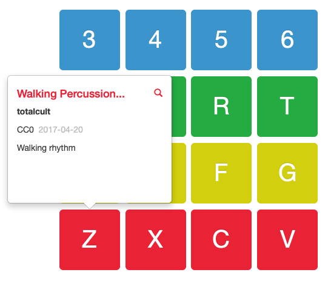

# Freesound Loop Generator

The **Freesound Loop Generator** (FLG) is a tool to create music loops using sound from Freesound. It features a simple 16-steps sequencer and 16 pads with several methods to load Freesound sounds into them.  FLG allows you to export the loops you make so you can load them into your samplers, sequencers and your favorite music making software. FLG is available at [https://ffont.github.io/freesound-loop-generator/](https://ffont.github.io/freesound-loop-generator/). Also you can check some sound examples you in [this Freesound pack](https://freesound.org/people/frederic.font/packs/28449/).  

FLG is a newer version (2020 update) of the old **FreeMaschine!** hack developed by Javi Agenjo, Bram de Jong and Frederic Font at Barcelona Music Hack Day 2014 ([see video here](https://www.youtube.com/watch?v=NCYBjv2wDAw)). It includes a bit (not too much) of code refactoring, but most of the code is still pretty old and probably contains many bugs.

## Features

* 16 pads that can load one Freesound sound each and can be played with your computer keyboard
* 5 methods for automatically loading sounds into the pads
* A programable 16-steps sequencer with randomize option and adjustable tempo
* License filter to make sure all sounds you get from Freesound fit your licensing needs
* Export functionalities to easily integrate the generated loops in your music production workflow:
  * Download the generared loop as a `wav` file
  * Download a 32-seconds long `wav` file inluding all the sounds loaded in the pads in a  2-seconds grid
  * Download the step sequencer pattern as a `mid` file 
  * Download attribution files together with the `wav` files which will facilitate Creative Commons attribution requirements

## How to use Freesound Loop Generator

Basically the only thing you should do is wait for some sounds to be loaded in the pads (by default FLG will search for sounds using the keyword *percussion*) and hit Play! But here are some more details of all the different features:

### Loading sounds into the pads

You can load the sounds into the individual pads using one of the 5 modes listed in the top part of the interface, just below the logo:

* **Text query**: use this mode to select sounds to be loaded in the pads based on some query terms. Just add some query terms in the input box (e.g. try with *glass*, *wood*, ...) and click `Search!`
* **By tags**: this mode allows you to select the sound of a specific pad individually. After selecting the mode, click on a pad to display a popover with information about the sound currently loaded in it (if any). Then click in the search icon that will appear next to the file name. A modal will appear with a search box you can use to find new sounds. Preview the sounds using the play buttons that will appear and finaly select the sound you want by clicking on its name. This will load the sound in the pad.

* **Timeline**: use this mode to load sounds in the pads based on Freesound sounds' popularity in a specific time period. Select a month and a year and your pads will be loaded with the most popular sounds uploaded during that time. This is using a similar algorithm to the one I use for another small Freesound project of mine called [Freesound Timeline](https://ffont.github.io/freesound-timeline/).
* **Similarity**: this mode allows you to replace all the sounds in your pads for other sounds which are acoutically similar. It uses Freesound's *similar sounds* feature. Just select the mode and click `Replace sounds by similarity...`. Sometimes it takes a bit of time for all sounds to be replaced.
* **Random**: well, this one does not need much explanation. Just click `Replace sounds randomly...` and all your pads will load random sounds from Freesound.

In all of the modes, FLG adds a limit to the duration of the sounds that are loaded, only short sounds (less than1  second) are considered.

You can use the **license filter** at the bottom of the interface to limit the licenses of the sounds used in FLG. Select one of the following options:

* **All licenses**: will include CC0, CC-BY and CC-BY-NC sounds.
* **Exclude CC-BY-NC**: will exclude sounds with restricted commercial use. Use that option if you plan to use the loops you make with FLG commercially and are fine giving attribution.
* **Only CC0**: will only search for sounds with CC0 (public domain) license. Use that option if you won't be able to give attribution for the sounds in the loops generated with FLG.

### Using the sequencer

By default FLG loads a random sequence in the 16-steps sequencer. You can *start*, *stop* and set the *tempo* of the sequence using the sequencer controls:
 

You can also get a new random sequence by clicking on the *random* button (the crossed arrows):

You can edit the individual steps of the sequenbce by clicking on the *sequencer* button:

This will show a grid of 16x16 that you can use to activate or deactivate the individual steps of the sequence for each of the 16 pads:

Once in that view, you can click the *pads* button to return to the pads view:

### Exporting loops, files and sequence

## License 

FLG source code is released under MIT license. FLG uses the following 3rd party libraries:

* [Recorderjs](https://github.com/mattdiamond/Recorderjs) by Matt Diamond (MIT licensed)
* [jsmidigen](https://github.com/dingram/jsmidgen) by Dave Ingram (MIT licensed)
* [bootstrap](https://getbootstrap.com) by Twitter, Inc (MIT Licensed)
* [jquery](https://jquery.com) by jQuery foundation (MIT licensed)
